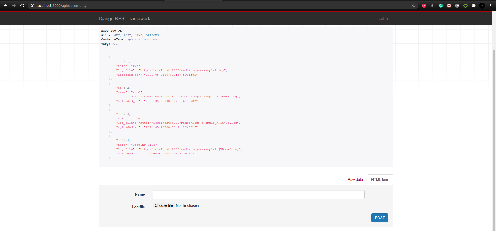
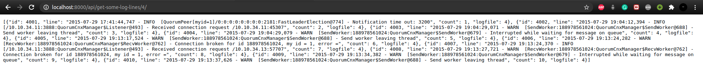

# Elastic-CFC
EzLogs 📝

## Setup:

### 1.Virtual Environment Setup :
##### For Linux :
```
$python3 venv env 
$source env/bin/activate
```
##### For Windows :
```
$py -m venv env
$env/Scripts/activate
```
####2. Installing Deps:

```
$pip install wheel
$pip install -r requirements.txt
```
#### 3. Create Database Tables and Superuser:

```
Note: For Windows Replace python3 with py or python

cd core/
$python3 manage.py makemigrations
$python3 manage.py migrate
$python3 manage.py createsuperuser
```


### 4. Install Redis and Start Server
```
sudo apt-get install redis-server

sudo service redis-server start [Options: {start|stop|restart|force-reload|status}]

```

### 5. Running Celery

`celery -A core worker -l INFO`

### 6. For Elastic Search Index Build 

- *Note : Run this command from project root directory*
```
$./manage.py search_index --rebuild

```
### 7. Run Server

*Note : You have to do **Step - 6 and 7** everytime when you upload a new **log file** through **API***

```
$pyhton3 manage.py runserver

```
<hr>

### REST API'S FOR THIS PROJECT
 - http://localhost:8000/api/document/ *(For Uploading New Log File, METHOD = GET/POST)*
 - http://localhost:8000/api/get-some-log-lines/<FILE_ID>/    *(For getting first 'N' lines from recent uploaded log, METHOD = GET)*
 - http://localhost:8000/api/search/?q=<SEARCH_QUERY>&file_id=<File_ID> *(For getting search result based upon user search query, METHOD = GET/POST)*
 
<hr>

### Screenshots



<hr>


<hr>

